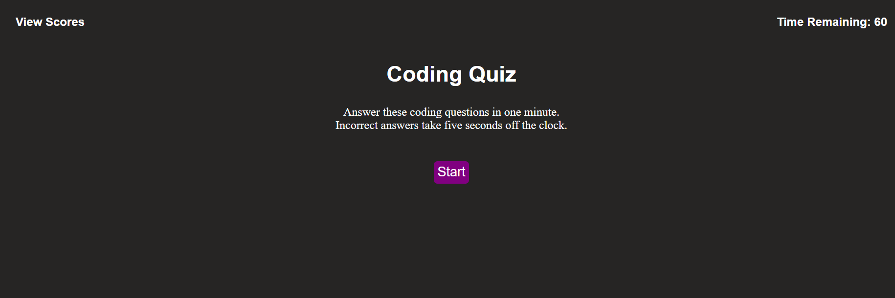

# Week 4 Homework - Code Quiz

## Description

This website was created as a homework assignment for the University of Richmond coding boot camp. The task was to create a timed quiz application with a score-saving function. While working on this assignment, I learned about web APIs and dynamically updating the HTML and CSS of a site with JavaScript.

## Installation

N/A

## Usage

Visit the website at https://madchazo.github.io/HW4-code-quiz/. Click the start button to begin the quiz, and you will be given one minute to answer 10 questions drawn from what I've learned so far in coding boot camp. Incorrect answers will deduct five seconds from the clock. At the end of the quiz, you will be given the option to save your score and initials locally.

## Credits

All of the code for this site was written by me.

## License

See the LICENSE file in the repo.
